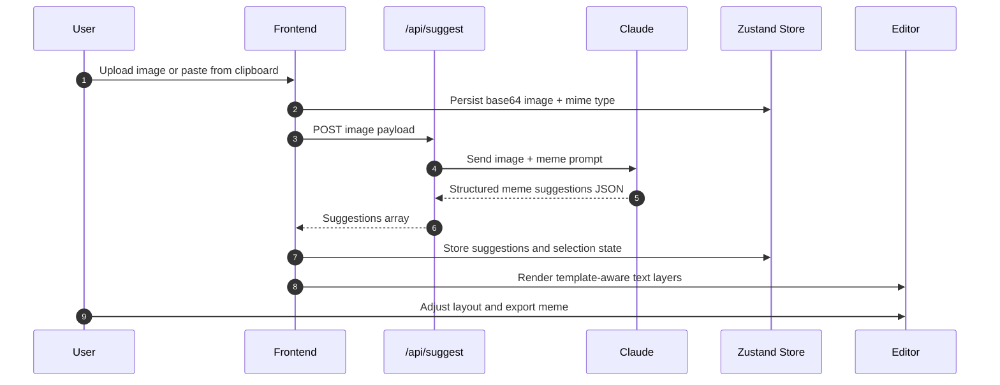

# MagicMeme

[](https://nextjs.org)
[](https://react.dev)
[](https://www.typescriptlang.org)
[](https://supabase.com)
[](https://www.anthropic.com)
[](#license)

[](#deployment)
[](#tech-stack)
[](#product-overview)
[](#frontend-architecture)

> **Frontend-first AI meme creation platform** for turning any image into a polished, shareable meme with contextual AI suggestions, a premium canvas editor, and live social reactions.

MagicMeme is built to feel like a funded startup product: sharp visuals, deliberate motion, responsive layout systems, and an AI workflow that stays invisible until it adds real value.

---

## Product Overview

MagicMeme is an AI-native meme creation platform that takes a user from raw image to shareable meme in a few intentional steps:

1. Upload an image from desktop, paste, or camera.
2. Send the image to Claude for contextual meme suggestions.
3. Render the best suggestion into a template-aware editor.
4. Refine the result in a premium Fabric.js canvas.
5. Save and share the meme through a public page.
6. Capture live reactions with Supabase Realtime.

The product exists to solve a simple problem with a high-quality answer: meme tooling is usually either too crude or too noisy. MagicMeme treats the meme workflow as a modern frontend product problem, not a toy generator.

The product vision is to make meme creation feel fast, polished, and social by combining:

- AI-assisted caption generation.
- Template-driven rendering.
- Editor-grade layout control.
- Mobile-first sharing and reaction loops.
- A visual system that feels closer to Framer or Linear than a typical hackathon app.

Frontend-first philosophy:

- The interface is the product.
- Motion should clarify state changes, not decorate them.
- The AI is a workflow accelerator, not the UI itself.
- Every screen should feel production-ready on mobile and desktop.

---

## Screenshots / Preview

Drop your rendered screenshots into a `docs/screenshots/` folder and keep the names consistent with the table below.

| View                 | What it should show                                          | Suggested asset name                |
| -------------------- | ------------------------------------------------------------ | ----------------------------------- |
| Landing page         | Premium hero, editorial layout, upload CTA, feature cards    | `docs/screenshots/landing-page.png` |
| Meme suggestion grid | AI-generated suggestions arranged in a clean responsive grid | `docs/screenshots/suggestions.png`  |
| Editor page          | Fabric canvas, layer controls, template editing, export flow | `docs/screenshots/editor.png`       |
| Mobile view          | Thumb-friendly navigation and stacked responsive layout      | `docs/screenshots/mobile.png`       |
| Share page           | Public meme card, copy link action, live reactions           | `docs/screenshots/share.png`        |

### Preview notes

- Keep screenshots high-resolution and consistent in browser chrome.
- Capture the app in both light content areas and dark shell surfaces.
- Prefer real meme content over placeholder lorem ipsum so the product feels alive.

---

## Features

### AI Features

- Image-to-caption analysis using Anthropic Claude.
- Structured meme suggestion output for fast downstream rendering.
- Contextual prompts tuned for meme tone, brevity, and punchline quality.
- AI suggestions that feed directly into the editor instead of opening a separate chat UI.

### Frontend Features

- Premium landing page with a strong hero hierarchy.
- Framer Motion transitions for route states and interaction polish.
- Responsive shell architecture for desktop, tablet, and mobile.
- Modular UI composition across upload, suggest, edit, share, and reactions.
- Reusable card, button, and panel primitives built for consistency.

### Mobile Features

- Thumb-friendly navigation and bottom-aligned actions.
- Drag-and-drop, paste, and camera capture support from the same entry point.
- Adaptive stacks and grid collapse behavior for narrow screens.
- Canvas and share flows optimized for touch interaction.

### Social Features

- Public share pages for generated memes.
- Copy-link sharing for fast distribution.
- Live reaction counts with Supabase Realtime.
- Emoji reaction flows designed for quick feedback loops.

### Editor Features

- Template-driven meme rendering.
- Fabric.js-based canvas editing.
- Zone-aware text placement and automatic layer generation.
- Export flow for saved PNG output.
- Layer and text controls that support fast iteration.

### Performance Features

- Node.js runtime for large base64 image processing.
- Server routes that keep AI and storage logic off the client bundle.
- State separation through Zustand instead of heavyweight global context.
- Responsive image and layout configuration in Next.js.
- Focused component boundaries to avoid unnecessary rerenders.

---

## Tech Stack

| Layer                  | Technology                            | Why it is used                                                            |
| ---------------------- | ------------------------------------- | ------------------------------------------------------------------------- |
| Frontend framework     | Next.js 16 App Router                 | Route-driven UI, server actions, and clean frontend architecture          |
| UI runtime             | React 19 + TypeScript                 | Strong type safety and modern component composition                       |
| Styling                | Tailwind CSS v4                       | Fast, scalable utility styling with minimal CSS overhead                  |
| Animation              | Framer Motion                         | Route transitions, tactile feedback, and premium motion language          |
| Canvas / export        | Fabric.js, html2canvas                | Meme editing, text layers, and image export                               |
| State management       | Zustand                               | Lightweight flow state for upload, suggest, edit, share, and editor state |
| Data / auth / realtime | Supabase                              | Storage, public reads, reactions, and realtime updates                    |
| AI                     | Anthropic Claude Sonnet 4             | Image understanding and meme suggestion generation                        |
| UI utilities           | clsx, tailwind-merge, react-hot-toast | Composition helpers, class merging, and feedback toasts                   |
| Deployment             | Vercel + Supabase                     | Frontend hosting and managed backend services                             |

### Runtime and API boundaries

| Surface                             | Responsibility                                                             |
| ----------------------------------- | -------------------------------------------------------------------------- |
| `app/page.tsx`                      | Orchestrates the upload -> suggest -> edit -> share flow                   |
| `app/api/suggest/route.ts`          | Sends the uploaded image to Claude and returns structured meme suggestions |
| `app/api/memes/route.ts`            | Saves exported memes to Supabase Storage and records metadata              |
| `app/api/memes/[id]/react/route.ts` | Handles reaction writes and live social feedback                           |

---

## Frontend Architecture

MagicMeme is structured as a flow-based frontend, not a collection of unrelated pages.

### 1. Component architecture

- `app/page.tsx` owns the top-level product journey and step transitions.
- `components/upload/` handles import behavior, webcam capture, and paste support.
- `components/suggest/` renders AI suggestions as a responsive selection surface.
- `components/editor/` owns the canvas editor, layer generation, and export logic.
- `components/share/` packages the public meme card, copy-link behavior, and reactions.
- `components/ui/` provides reusable primitives such as buttons, spinners, and indicators.

### 2. Layout system

- The app uses a premium shell with layered ambient backgrounds and glass surfaces.
- The top navigation stays lightweight and collapses away during full-screen editing.
- Shared layout primitives keep spacing, width, and border rhythm consistent across screens.
- Public share views reuse the same visual language so the product feels cohesive end-to-end.

### 3. Responsive system

- The landing page uses a two-column editorial layout on desktop and a stacked layout on smaller screens.
- Hero copy, feature cards, and workflow hints collapse into a vertical reading order on mobile.
- The editor and share surfaces preserve touch-friendly spacing and clear tap targets.
- Grid and panel widths are tuned for both content density and thumb reach.

### 4. Reusable UI patterns

- Glass panels and premium cards establish a consistent visual hierarchy.
- Feature pills, badges, and section labels are reused to keep the surface readable.
- Shared buttons and cards reduce the chance of visual drift between product areas.
- Motion variants are reused across route steps to keep transitions coherent.

### 5. Zustand store architecture

`store/useMemeStore.ts` is the central flow store. It tracks:

- The active app step: `upload`, `suggest`, `edit`, `share`.
- Uploaded image data and MIME type.
- AI suggestions and the currently selected suggestion.
- Saved meme metadata and share URLs.
- Editor state such as selected template, layers, and exported image URL.

This keeps the flow predictable and avoids over-centralizing all UI state in one component tree.

### 6. Template rendering system

- `lib/templates.ts` defines meme templates as structured text zones.
- `components/editor/layerBuilder.ts` converts AI suggestions and template zones into Fabric-compatible layers.
- The editor works from template metadata instead of hard-coded pixel positions.
- This makes new meme formats easy to add without rewriting the canvas logic.

### 7. Animation architecture

- Framer Motion handles page entry, exit, and interactive feedback states.
- Motion is used to reinforce hierarchy, not to distract from the task flow.
- Upload, suggestion, and share states transition with subtle vertical movement and blur.
- Hover and tap interactions stay tactile and restrained to preserve a premium feel.

### Architecture diagram

```mermaid
flowchart LR
  A[User uploads image] --> B[UploadZone / WebcamCapture]
  B --> C[Zustand flow state]
  C --> D[/api/suggest]
  D --> E[Anthropic Claude]
  E --> F[Structured meme suggestions]
  F --> G[SuggestionGrid]
  G --> H[Template selection]
  H --> I[layerBuilder.ts]
  I --> J[Fabric.js canvas editor]
  J --> K[/api/memes]
  K --> L[Supabase Storage + memes table]
  L --> M[Public share page]
  M --> N[Live reactions via Supabase Realtime]
```

---

## Design System

MagicMeme follows a premium dark product system with a lime accent that feels intentional, not decorative.

### Theme philosophy

- Dark-first surfaces keep the focus on the meme content and editor canvas.
- Lime is used as a precision accent for affordance, action, and status.
- Glass effects are used sparingly, only where they improve depth and separation.
- The overall feel is closer to Framer or Linear than a typical social toy app.

### Typography system

- Strong hierarchy with oversized hero type and compact supporting copy.
- Sans-serif typography for clarity and a modern product tone.
- Tight tracking and high-contrast weight changes to signal importance.
- Headings are built to read like a product launch page, not a generic landing template.

### Spacing system

- A simple 4px-based spacing rhythm keeps the layout predictable.
- Generous vertical spacing separates storytelling from interaction surfaces.
- Card padding is used to create breathing room around dense UI.
- Responsive gaps expand on desktop to support a more editorial composition.

### Color palette

| Token          | Purpose                        | Value         |
| -------------- | ------------------------------ | ------------- |
| Primary accent | Action, emphasis, active state | `#C8F135`     |
| Background     | Main shell and page canvas     | Near-black    |
| Surface        | Cards and elevated panels      | Dark grays    |
| Border         | Low-contrast separation        | Soft charcoal |
| Text primary   | High-emphasis content          | White         |
| Text secondary | Supporting copy                | Muted gray    |

### Responsive design approach

- Mobile-first layout decisions drive the base composition.
- Desktop expands into two-column and multi-panel structures when space is available.
- The editor and share pages preserve functional density without collapsing usability.
- Breakpoints are used to improve readability, not just to scale everything down.

### Motion philosophy

- Motion communicates state changes: upload, processing, transition, selection.
- The product avoids flashy movement and keeps transitions crisp and brief.
- Staggered reveals are used to guide attention through the hero and feature sections.
- Loading motion is meant to feel responsive and confident, not playful for its own sake.

### Inspiration references

- Framer: motion quality and premium product pacing.
- Linear: dark surface hierarchy and crisp spacing.
- Reddit layout structure: content-first feed logic and social readability.
- Modern AI products: clear affordances, quick iteration, and minimal cognitive overhead.

---

## Folder Structure

```text
magicmeme/
├── app/
│   ├── api/
│   │   ├── memes/
│   │   └── suggest/
│   ├── m/
│   │   └── [id]/
│   ├── globals.css
│   ├── layout.tsx
│   └── page.tsx
├── components/
│   ├── editor/
│   ├── home/
│   ├── layout/
│   ├── reactions/
│   ├── share/
│   ├── suggest/
│   ├── ui/
│   └── upload/
├── hooks/
├── lib/
├── public/
├── sql/
├── store/
├── types/
├── next.config.ts
├── tailwind.config.ts
├── tsconfig.json
└── README.md
```

### Structure notes

- `app/` holds the route-level application shell and API handlers.
- `components/` is organized by product surface instead of by generic UI category.
- `lib/` contains AI, Supabase, prompts, template logic, and utilities.
- `store/` holds the flow state and editor state.
- `sql/` contains the Supabase setup scripts for reactions and supporting schema.

---

## Installation Guide

### Prerequisites

- Node.js 20 or newer.
- A Supabase project with the required tables, storage bucket, and policies.
- An Anthropic API key with access to Claude Sonnet 4.

### 1. Clone the repository

```bash
https://github.com/Ramprakash852/MagicMeme.git
cd magicmeme
```

### 2. Install dependencies

```bash
npm install
```

### 3. Configure environment variables

Create a local `.env.local` file from the example in the section below.

### 4. Set up Supabase

Run the SQL scripts in the Supabase dashboard:

- `app/api/memes/route.ts` documents the `memes` table and `memes` storage bucket expectations.
- `sql/phase-6-reactions-final.sql` creates the `reactions` table, RPC, and realtime publication support.

You will need:

- Public read access for the `memes` table and `memes` storage bucket.
- The `reactions` table added to `supabase_realtime`.
- The `add_reaction` RPC available to anonymous users for public sharing.

### 5. Start the development server

```bash
npm run dev
```

Open [http://localhost:3000](http://localhost:3000) in your browser.

### 6. Validate the project

```bash
npm run build
npm run lint
```

### 7. Run production locally

```bash
npm run start
```

---

## Environment Variables

Create a local `.env.local` file using the following template.

```bash
# .env.example
NEXT_PUBLIC_SUPABASE_URL=
NEXT_PUBLIC_SUPABASE_ANON_KEY=
SUPABASE_SERVICE_ROLE_KEY=
ANTHROPIC_API_KEY=
NEXT_PUBLIC_APP_URL=http://localhost:3000
NEXT_PUBLIC_SITE_URL=http://localhost:3000
```

| Variable                        | Required    | Purpose                                        |
| ------------------------------- | ----------- | ---------------------------------------------- |
| `NEXT_PUBLIC_SUPABASE_URL`      | Yes         | Browser-safe Supabase project URL              |
| `NEXT_PUBLIC_SUPABASE_ANON_KEY` | Yes         | Public Supabase client key for frontend access |
| `SUPABASE_SERVICE_ROLE_KEY`     | Yes         | Server-side storage and database operations    |
| `ANTHROPIC_API_KEY`             | Yes         | Claude inference for meme suggestions          |
| `NEXT_PUBLIC_APP_URL`           | Recommended | Canonical app origin for share links           |
| `NEXT_PUBLIC_SITE_URL`          | Recommended | Public site origin for share previews          |

---

## AI Workflow

MagicMeme uses a structured AI pipeline so the frontend can stay deterministic while the model handles interpretation.



### Pipeline details

- Image upload is captured as a base64 data URL.
- The suggestion endpoint strips the data URL prefix and forwards the image to Claude.
- The prompt requests structured JSON so the UI can render suggestions without fragile parsing.
- The selected suggestion is mapped to a template in `lib/templates.ts`.
- `layerBuilder.ts` converts that suggestion into editor layers with canvas-safe coordinates.
- The exported meme is then saved to Supabase Storage and published as a public share page.

### Why this approach works

- The frontend stays in control of layout and interaction.
- The AI only handles semantic interpretation and caption generation.
- JSON output keeps the product predictable and easy to extend.
- The rendering pipeline is template-driven, so new formats are additive rather than invasive.

---

## Responsive Design Philosophy

- Mobile-first layout decisions define the initial component structure.
- The landing page shifts from an editorial two-column composition to a stacked reading order on smaller screens.
- Canvas and editor actions stay reachable without relying on hover-only interactions.
- Tablet widths preserve density while avoiding the cramped feel of a phone UI stretched too far.
- Grids collapse responsibly so content remains clear rather than merely smaller.

The goal is not just to fit smaller screens. The goal is to keep the product feeling intentional at every viewport width.

---

## Animation System

- Framer Motion powers the page transitions, staggered hero reveals, and selection states.
- Motion is used to communicate progress through the flow: upload, suggestion, edit, share.
- Hover states are subtle, quick, and tactile.
- Loading states are alive but controlled, which keeps the app feeling premium instead of noisy.

### Motion principles

- Use motion to clarify hierarchy.
- Keep durations short enough for a production product.
- Avoid playful animation that distracts from the task.
- Let movement reinforce confidence in the UI.

---

## Performance Optimizations

- The AI route runs in the Node.js runtime because base64 image payloads are large.
- Server logic for suggestions and saving memes stays off the client bundle.
- Zustand keeps flow state local and lightweight.
- Template rendering avoids heavy runtime branching by using structured zone definitions.
- Supabase storage offloads file hosting from the application server.
- The Next.js image pipeline is configured for remote Supabase assets.
- Component boundaries reduce unnecessary re-renders across the upload and editor flow.

### Practical notes

- Keep exported PNGs and preview assets reasonably sized.
- Avoid pushing AI processing into client-side effects.
- Use the shared design tokens and shell primitives instead of one-off styles.

---

## Deployment

### Vercel deployment steps

1. Push the repository to GitHub.
2. Import the project into Vercel.
3. Set the production environment variables listed above.
4. Confirm the Supabase project has the `memes` bucket and `reactions` setup applied.
5. Deploy the main branch.

### Recommended production checks

- Verify share URLs resolve correctly from `NEXT_PUBLIC_APP_URL`.
- Confirm the Claude API key is configured only in server environments.
- Test upload, suggestion, save, share, and reaction flows on mobile and desktop.
- Make sure realtime reactions are enabled in Supabase publications.

### Optional CLI deployment

If you use the Vercel CLI:

```bash
npx vercel
npx vercel --prod
```

---

## Future Improvements

- Collaborative meme editing with live cursors.
- Meme remix chains and branching remix histories.
- AI personalization based on creator tone and prior exports.
- Advanced social systems such as creator follows and collections.
- Creator profiles with saved styles and template preferences.
- A trending feed that surfaces the most reacted-to memes.

---

## Hackathon Context

MagicMeme was built to demonstrate that AI products can still be frontend-led, visually disciplined, and production-minded.

### Why this project was built

- To show how AI can accelerate a creative workflow without taking over the interface.
- To demonstrate a real product journey instead of a single isolated demo screen.
- To present a modern social content tool with strong visual polish.

### UX priorities

- Fast first interaction.
- Clear progress through the creation flow.
- Minimal cognitive overhead.
- High confidence in every handoff from upload to share.

### Design priorities

- Make the product feel funded, not improvised.
- Balance visual richness with task clarity.
- Keep the editor serious enough for creators and approachable enough for casual users.

### Engineering decisions

- Use a flow store to keep the product deterministic.
- Push AI work to server routes.
- Use templates and structured zones instead of brittle pixel-only layouts.
- Keep the UI modular so the system can grow without rewrites.

---

## Lessons Learned

### Frontend architecture lessons

- Flow-based applications need a strong central state model.
- Reusable layout primitives pay off quickly when multiple product modes share the same shell.
- Template metadata is easier to maintain than hard-coded editor logic.

### Responsive design lessons

- Mobile support should be designed, not retrofitted.
- Strong spacing and typography matter more than adding more UI on small screens.
- Editor affordances need to remain obvious when hover is unavailable.

### AI integration lessons

- Structured output is essential when the frontend must remain deterministic.
- The best AI features are the ones that collapse friction without creating a second interface.
- Server-side AI routes keep the client experience simpler and safer.

### UX learnings

- Users want momentum, not configuration.
- Visual confidence matters as much as raw functionality.
- Social products feel better when the share path is immediate and obvious.

---

## Contributors

| Role                 | Status | Notes                                               |
| -------------------- | ------ | --------------------------------------------------- |
| Maintainer           | Active | Owns product direction and releases                 |
| Frontend engineering | Open   | UI, motion, responsive layout, component systems    |
| AI workflow          | Open   | Prompt tuning, JSON schema, suggestion quality      |
| Backend / realtime   | Open   | Supabase schema, storage, reactions, share plumbing |

Contributions are welcome through issues and pull requests. Keep changes aligned with the existing product language: premium, intentional, and frontend-first.

---

## License

This project is distributed under the MIT License.

See the repository `LICENSE` file for the full text.
